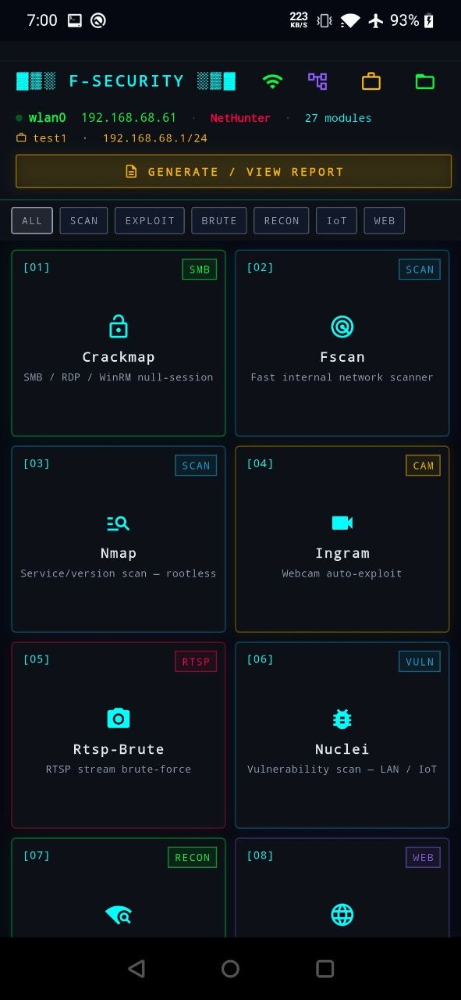
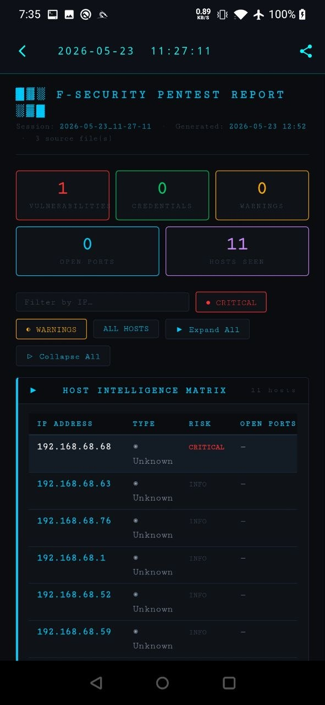
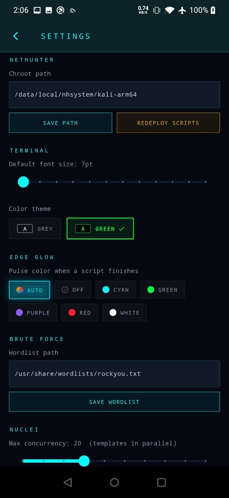
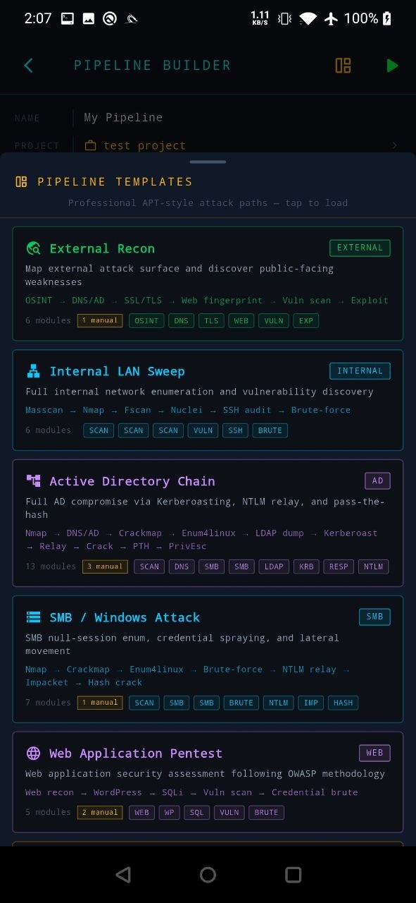
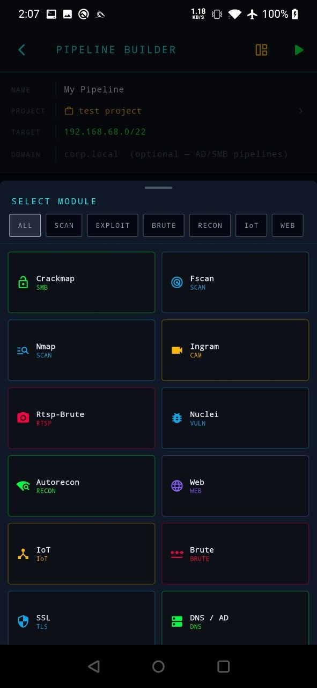
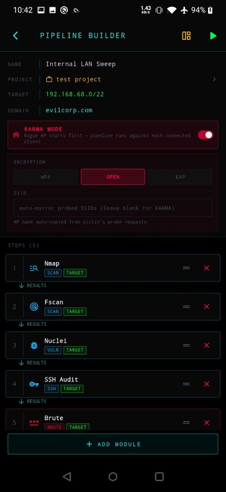

# F-Security — NetHunter Edition

<p align="center">
  
  &nbsp;
  
  &nbsp;
  
</p>

<p align="center">
  
  &nbsp;
  
  &nbsp;
  
</p>

<p align="center">
  <strong>On-device penetration testing suite for Android / Kali NetHunter</strong><br>
  50 modules · automated pipeline engine · KARMA rogue-AP suite · 8 chain data flows · real PTY terminal
</p>

---

> **Platform:** Android (rooted Kali NetHunter)  
> **Stack:** Flutter · Dart · flutter_pty · xterm · SQLite  
> **Author:** [InnerFireZ](https://github.com/InnerFireZ)

F-Security is a mobile penetration testing orchestration layer. All 50 modules run inside a real PTY terminal against the device's Kali NetHunter chroot — no SSH, no ADB bridge, everything on-device. Scripts are bundled inside the APK and deployed to the chroot on first launch.

**This project does not reinvent any tool.** It wraps nmap, nuclei, Metasploit, Hydra, CrackMapExec, Responder, Impacket, bettercap, aircrack-ng, tshark, wifite2, Ingram, fscan, AutoRecon, certipy, Evil-WinRM, chisel, john, hashcat, hostapd, dnsmasq, scapy, and more. F-Security automates repetitive setup, chains results between tools, and puts all of them behind a single tap — or a single automated pipeline run.

---

---

## Pipeline Engine

The centerpiece of F-Security. Define a multi-module sequence once; the engine runs them in order, automatically passing results from each module to the next.

### How it works

```
Pipeline UI
  └─ TARGET (CIDR / IP)     ─── injected as $TARGET env var
  └─ DOMAIN (AD domain)     ─── pre-seeded to chain_domain.txt

Module 1 (e.g. Nmap) runs:
  └─ discovers hosts → writes alive_hosts.txt
  └─ discovers open ports → writes chain_ports.txt

Module 2 (e.g. Nuclei) runs:
  └─ reads chain_ports.txt → only scans known open ports (no rescan)
  └─ discovers CVEs → marks done, next module starts

Module 3 (e.g. Brute) runs:
  └─ reads chain_ports.txt → targets only services it can brute
  └─ cracks creds → writes chain_creds.txt

... and so on until the chain is complete
```

No prompts. No interaction. No SSH. The phone does the pentest.

### KARMA pipeline integration

Enable **KARMA MODE** in the pipeline builder to use the rogue AP as the pipeline entry point. Configure encryption (WPA / OPN / Corporate) and an optional fixed SSID — blank means auto-mirror every probed network.

At runtime KARMA starts in the background as a dedicated PTY (visible in the sidebar). When a client connects, the pipeline steps execute against that client's IP. After the steps finish the AP keeps running, ready for the next victim. Stop kills both the AP and any in-progress steps.

| Env var | Values | Effect |
|---------|--------|--------|
| `KARMA_MODE` | `wpa` / `opn` / `eap` | AP encryption type passed to karma.sh |
| `KARMA_SSID` | name or empty | Force a specific SSID; empty = auto-mirror probed networks |

### Chain files

Eight shared state files flow data between modules within a pipeline session:

| File | Producer | Consumer |
|------|----------|----------|
| `alive_hosts.txt` | Nmap, Fscan, Masscan, Bettercap, IoT, RTSP, VNC, NTLM Relay, PRET | All targeted modules |
| `chain_ports.txt` | Nmap, Fscan, Masscan, DNS/AD, VNC, SNMP, PRET | Nuclei, Brute, SSL, SSH Audit, WPScan, VNC, RTSP, SQLMap |
| `chain_creds.txt` | Brute, Crackmap, VNC, Wifite, LinPEAS, PRET, NetSniff | Crackmap, Impacket, EvilWinRM, LDAP Dump |
| `chain_hashes.txt` | Responder, NTLM Relay, MITM6, Kerberos, Crackmap | Hash Cracker |
| `chain_users.txt` | Enum4linux, LDAP Dump, Crackmap | Kerberos, Brute |
| `chain_dc.txt` | DNS/AD (auto-discovered) + Pipeline UI | Kerberos, LDAP Dump, MITM6, EvilWinRM, Certipy |
| `chain_domain.txt` | DNS/AD + Pipeline UI pre-seed | MITM6, LDAP Dump, Kerberos, Certipy |
| `chain_web_urls.txt` | theHarvester, Web | Nuclei, WPScan, SQLMap |

### Interface auto-detection

Every module that needs a network interface calls `resolve_iface` from `lib.sh`. It:
1. Reads the `IFACE` env var if already set
2. Reads `/tmp/.fsec_iface` (set by the previous module in the chain)
3. Calls `auto_iface([wifi|any])` — picks the first live non-Android interface
4. Writes the result to `/tmp/.fsec_iface` so the next module inherits it

### Built-in pipeline templates

| Template | Modules | Purpose |
|----------|---------|---------|
| **External Recon** | theHarvester → DNS/AD → Web → Nuclei → SSL → Brute | OSINT + external attack surface |
| **Internal LAN Sweep** | Masscan → Nmap → Nuclei → Brute → Crackmap → Exploit → Impacket | Full internal LAN pentest |
| **Active Directory Chain** | Nmap → DNS/AD → Crackmap → Enum4linux → LDAP Dump → Kerberos → Responder → NTLM Relay → MITM6 → Hash Cracker → Impacket → EvilWinRM → LinPEAS | Full AD kill chain |
| **SMB / Windows Attack** | Nmap → Crackmap → Enum4linux → Brute → NTLM Relay → Impacket → Hash Cracker | Windows credential harvesting |
| **Web Application Pentest** | Web → WPScan → SQLMap → Nuclei → Brute | Web app attack chain |
| **WiFi Assault** | Wifite → Bettercap → RTSP-Brute → VNC Brute → PRET | WiFi + post-association |
| **IoT / OT Discovery** | Ingram → SNMP Sweep → PRET → IoT → BLE Recon → Air-BT | IoT/OT full coverage |
| **Post-Exploitation** | LinPEAS → Impacket → Tunnel/Pivot → Hash Cracker → ADCS → EvilWinRM | Post-access escalation |
| **Full APT Kill Chain** | 12-module chain covering OSINT → recon → exploitation → lateral movement → persistence | End-to-end simulation |

---

## Modules

50 modules across 8 categories. All pipeline-capable modules run fully unattended when launched from a pipeline (no prompts, auto-detect interfaces, auto-source chain files).

### Scan

| # | Module | Tag | Description |
|---|--------|-----|-------------|
| 02 | Fscan | SCAN | Fast internal network scanner — host discovery + port/service scan |
| 03 | Nmap | SCAN | Full SYN/UDP/version/script scan with root privileges |
| 06 | Nuclei | VULN | CVE template vulnerability scan — LAN / IoT / web |
| 11 | SSL | TLS | TLS/SSL certificate audit — expiry, weak ciphers, CVEs |
| 32 | SSH Audit | SSH | SSH algorithm, cipher, key-exchange audit — multi-host parallel |
| 49 | Masscan | SCAN | Ultra-fast port sweep — million packets/sec — large /8–/16 ranges |

### Recon

| # | Module | Tag | Description |
|---|--------|-----|-------------|
| 01 | Crackmap | SMB | SMB/RDP/WinRM null-session enum · shares · users · RID brute |
| 07 | Autorecon | RECON | Ping sweep + AutoRecon multi-tool recon per host |
| 12 | DNS / AD | DNS | DNS zone transfer + Active Directory / LDAP enum + DC discovery |
| 17 | Responder | RESP | LLMNR/NBT-NS/MDNS poisoning · NTLMv2 hash capture |
| 20 | Deauth Watcher | WIFI | Passive deauth/disassoc detector with attacker MAC tracking |
| 25 | Bettercap | MITM | ARP MITM · net.recon · net.sniff · http.proxy |
| 27 | Wifite | WIFI | Auto WiFi audit — WPA handshake · WPS PIN · PMKID attack |
| 28 | NetSniff | SNIFF | Passive tshark capture · live credential harvester (FTP/HTTP/Telnet/SMTP) |
| 36 | SNMP Sweep | SNMP | 30-string community brute · MIB walk · sysinfo/interfaces/routes/processes |
| 42 | Enum4linux | SMB | SMB/NetBIOS/LDAP/RPC — full Windows/Samba enumeration |
| 43 | theHarvester | OSINT | OSINT — emails · subdomains · IPs · employee names (Google/Bing/Shodan/...) |
| 48 | LDAP Dump | LDAP | ldapdomaindump — AD users · groups · computers · SPNs · GPOs |

### Exploit

| # | Module | Tag | Description |
|---|--------|-----|-------------|
| 14 | Post | POST | Post-discovery action hub — per-host exploit menus |
| 15 | C2 | C2 | 13 reverse shell payload types + background nc/socat listener |
| 16 | Exploit | EXP | CVE port-match quick-strike → MSF launcher — 30+ CVE entries |
| 22 | MAC Bypass | MAC | Wired LAN MAC filter bypass — sniff → spoof → DHCP |
| 26 | NTLM Relay | NTLM | Responder + ntlmrelayx — LLMNR capture → SMB/LDAP relay |
| 34 | MITM6 | MITMv6 | IPv6 DHCPv6 poison → NTLM relay · 4 modes: SMB/LDAP/delegate/ADCS ESC8 |
| 35 | ADCS | ADCS | Certipy — ESC1-8 template enum · auto-exploit ESC1 → PKINIT → NT hash |
| 39 | Impacket | IMP | secretsdump · psexec · wmiexec · Pass-the-Hash · samrdump |
| 44 | Evil-WinRM | WRM | WinRM interactive shell · PTH · certificate auth · file upload/download |
| 45 | Tunnel/Pivot | PIVOT | chisel SOCKS5 · sshuttle · socat port relay · socat SSL wrap |
| 46 | LinPEAS | PE | PEASS-ng privilege escalation — local · remote SSH · credential hunting |

### Brute

| # | Module | Tag | Description |
|---|--------|-----|-------------|
| 05 | RTSP-Brute | RTSP | RTSP stream brute-force · credential discovery for IP cameras |
| 10 | Brute | BRUTE | SSH/FTP/HTTP/Telnet/SMB/RDP brute-force via Hydra |
| 24 | Vivacom Keygen | WIFI | A1/Vivacom default WiFi password generation from BSSID |
| 31 | VNC Brute | VNC | VNC subnet scan · RFB auth brute · no-auth detection · desktop screenshots |
| 33 | Kerberos | KRB | Kerbrute user enum (10M wordlist) → ASREPRoast → Kerberoast |
| 41 | Hash Cracker | HASH | john + hashcat · NTLMv2 · NTLM · Kerberos TGS/AS-REP · auto-source chain |

### Web

| # | Module | Tag | Description |
|---|--------|-----|-------------|
| 08 | Web | WEB | whatweb / nikto / gobuster / feroxbuster — multi-tool web recon |
| 40 | SQLMap | SQL | SQL injection — detect · extract · os-shell · full automation |
| 47 | WPScan | WP | WordPress scanner — plugins · themes · users · CVEs |

### IoT

| # | Module | Tag | Description |
|---|--------|-----|-------------|
| 04 | Ingram | CAM | Webcam auto-exploitation via Ingram framework |
| 09 | IoT | IoT | IoT/SCADA/camera discovery + exploit menus |
| 21 | Flipper Detector | BT | Bluetooth scan — detects Flipper Zero by OUI `80:E1:26` |
| 23 | Probe Sniffer | WIFI | WiFi probe request capture · burst detection · GPS logging · wardriving map |
| 30 | PRET | PRT | Printer discovery · PJL/PS/PCL audit + PRET exploit framework |
| 37 | Air-BT | BLE | BLE scanner · GATT enum · 65 CVE matches · attack PoCs · bluebinder auto-init |
| 38 | BLE Recon | BLE | bettercap ble.recon · live scanner · http-ui dashboard over WiFi |

### WiFi / Rogue AP

| # | Module | Tag | Description |
|---|--------|-----|-------------|
| 50 | KARMA | ROGUE | Rogue AP / evil-twin — WPA · OPN · EAP(WPE) · probe-mirror · auto client attack chain · Responder NTLM · tcpdump · pipeline-aware |

### Fire

| # | Module | Tag | Description |
|---|--------|-----|-------------|
| 18 | WiFi Deauth All | WIFI | Monitor mode scan → deauth every detected AP simultaneously |
| 19 | WiFi Deauth Target | WIFI | Select AP → continuous targeted deauth |
| 29 | NetKill | ARP | ARP-poison the gateway → drops internet for all LAN clients |

---

## Projects & Reports

### Project mode

Assign any module run to a project. The app automatically:
- Attaches the session folder to the project
- Parses `nmap.txt`, `fscan.txt`, `masscan.txt` → imports hosts + open ports
- Parses `brute.txt`, `chain_creds.txt`, `crackmap.txt` → imports credentials
- Parses `cracked.txt` (john/hashcat `--show` output) → imports cracked hashes

All imported data is stored in a local SQLite database (`fsecurity_projects.db`).

### Project tabs

| Tab | Contents |
|-----|----------|
| **Sessions** | All module runs linked to this project — tap to browse result files |
| **Hosts** | Discovered hosts with port lists (tap host to expand) |
| **Creds** | Captured credentials (live brute-force results) + cracked hashes |
| **Notes** | Free-text notes per project |
| **Images** | Screenshots captured during VNC Brute or IoT modules |

### HTML reports

One tap generates a self-contained HTML report including:
- Executive summary with CVSS-style risk metrics
- Vulnerability findings from nuclei.txt (filtered to medium+)
- Credential table (brute-force + cracked hashes + chain_creds.txt)
- SMB/network share findings
- DNS/Active Directory enumeration results
- IoT device findings
- Raw session file viewer

Reports are generated locally on-device — no cloud, no upload.

---

## Push Notifications

The app fires heads-up notifications for live detections without any extra setup.

| Module | Trigger | Notification |
|--------|---------|--------------|
| **Flipper Detector** | Flipper Zero BLE device found | Device name + MAC address |
| **Deauth Watcher** | Real deauth attack detected | Attacker MAC · SSID · burst count |

**Attack vs. legitimate disconnect** heuristics:
- Burst ≥ 5 frames from the same source MAC within 5 s → always an attack
- Broadcast deauth + non-legitimate reason code + ≥ 2 frames → attack

Each alert fires once per attacker+SSID pair per session (deduplicated).

---

## Requirements

- Android 5.0+ with **root** (Magisk)
- **Kali NetHunter** full chroot at `/data/local/nhsystem/kali-arm64` (or variant)
- Tools installed inside chroot (install as needed per module):

```bash
# Core
apt install nmap masscan nuclei hydra crackmapexec enum4linux-ng

# AD / Windows
apt install impacket-scripts evil-winrm certipy-ad bloodhound ldapdomaindump

# Password cracking
apt install john hashcat

# Network / MITM
apt install responder mitm6 bettercap tshark

# Web
apt install nikto gobuster feroxbuster sqlmap wpscan

# WiFi
apt install aircrack-ng wifite2

# KARMA — rogue AP (requires secondary WiFi adapter on wlan1)
apt install hostapd dnsmasq inotify-tools
pip3 install scapy mac-vendor-lookup netaddr colorama getkey

# Pivot
apt install chisel sshuttle socat
```

### GPS — Probe Sniffer map

The Probe Sniffer module logs GPS coordinates alongside captured probe requests. GPS requires a companion Android app that relays NMEA sentences over TCP to **`127.0.0.1:10110`**.

Install any app named **"gpsdRelay"** or **"GPS NMEA relay"** from the Play Store. Without GPS the sniffer still captures probes — coordinates and map are simply omitted.

---

## Install

**From release:**
```bash
adb install F-Security.apk
```

**From source** (requires Flutter SDK + Android SDK + Java 21):
```bash
git clone https://github.com/InnerFireZ/F-Security-APP.git
cd F-Security-APP
flutter pub get
bash build.sh
adb install app-release.apk
```

> Java 25 EA is not supported by Gradle — use Java 21:
> ```bash
> export JAVA_HOME=/usr/lib/jvm/java-21-openjdk-amd64
> ```

On first launch the app detects root, locates the chroot, and deploys all bundled scripts automatically. Use **Settings → Redeploy** to force a re-deploy if needed.

---

## Architecture

### Execution model

Every module runs inside a `flutter_pty` pseudoterminal:

```
su -c "echo $$ > /data/local/tmp/fsec_<ts>.pid; \
       chroot <chroot> /usr/bin/env -i \
         HOME=/root TERM=xterm-256color PATH=<linux-path> \
         SESSION_DIR=<pipeline-dir> TARGET=<ip> DOMAIN=<domain> \
         /bin/bash /root/f-security/<script>"
```

The `echo $$` saves the shell PID so the stop button can send `kill -INT -<pgid>` to the entire process group — identical to Ctrl+C in a real terminal. Scripts with `trap '_cleanup' EXIT` run cleanup on stop.

### Script deployment

Scripts ship as Flutter assets bundled in the APK. On first launch (or when the deploy version is bumped) the deployer extracts them to a staging directory, copies them into the chroot at `/root/f-security/`, and sets executable permissions. The deploy version is an integer in `ScriptDeployer._currentVersion` — bump it on any script change.

### Results storage

Scripts write output to `/root/f-security/results/<project_slug>/<timestamp>/` (created by `make_outdir()` in `lib.sh`). The Results screen lists these sessions and lets you browse files, view reports, and delete sessions.

Results discovery uses `find -maxdepth 3 -mindepth 2` from the results root — all result files must be at depth ≤ 3 to be visible. KARMA writes all output flat into the session root (not a subdirectory) to ensure every file is discoverable.

### Pipeline session directory

When a pipeline is running, all modules share a single `SESSION_DIR` path passed as an environment variable. Chain files (`alive_hosts.txt`, `chain_ports.txt`, etc.) are written to and read from this shared directory — not to individual module output directories.

### Signal / cleanup

The stop button reads `/data/local/tmp/fsec_<ts>.pid` and sends `SIGINT` to the process group (`kill -INT -<pid>`). This propagates to bash AND any foreground child (bettercap, ntlmrelayx, etc.), triggering their EXIT traps. Scripts use `trap '_cleanup' EXIT`.

### lib.sh helpers

| Function | Description |
|----------|-------------|
| `banner "TITLE" "subtitle"` | ctOS header box |
| `section "NAME"` | Section separator |
| `require_tool <bin> <hint>` | Exit with install hint if binary missing |
| `check_tool <bin>` | Non-fatal tool check — returns 0/1 |
| `make_outdir` | Creates `results/<slug>/<timestamp>/` and prints absolute path |
| `auto_iface [wifi\|any]` | Auto-selects best live interface (skips Android rmnet/bond/dummy) |
| `resolve_iface [mode]` | Checks `$IFACE` env → `/tmp/.fsec_iface` → auto_iface → saves result |
| `get_ip [iface]` | Returns IPv4 for an interface |
| `mark_done <path>` | Writes `.done` marker; pipeline runner uses this to advance to next module |
| `run_fg <cmd> [args...]` | Runs cmd in foreground; saves PID to `/tmp/.fsec_tool.pid` for soft Ctrl+C |
| `start_spin "msg"` / `stop_spin` | Spinner for slow operations |
| `pick_nmap_file` | Offers to reuse existing `nmap.txt` instead of re-scanning |
| `$RED $GREEN $YELLOW $CYAN $BOLD $DIM $RESET` | ANSI color variables |

---

## Adding a New Module

### Step 1 — Write the bash script

Copy `assets/fsec/template/script-template.sh` to `assets/fsec/scripts/your_tool.sh`.

Every script must follow these conventions:

```bash
#!/usr/bin/env bash
source "$(dirname "$0")/../lib.sh"
set -uo pipefail

banner "TOOL NAME" "short description"
require_tool mytool "apt install mytool"

outdir="$(make_outdir)"
outfile="$outdir/mytool.log"
: > "$outfile"

_cleanup() {
  kill "$_bg_pid" 2>/dev/null || true
}
trap '_cleanup' EXIT

# ── Pipeline auto-mode ─────────────────────────────────────────────────────────
# If SESSION_DIR is set, run non-interactively and publish results to chain files
if [[ -n "${SESSION_DIR:-}" ]]; then
  TARGET="${TARGET:-}"
  [[ -z "$TARGET" ]] && [[ -s "${SESSION_DIR}/alive_hosts.txt" ]] && \
    TARGET=$(head -1 "${SESSION_DIR}/alive_hosts.txt")
  
  # ... run tool, write results ...
  
  # Publish to chain files
  grep -oE '[0-9]+\.[0-9]+\.[0-9]+\.[0-9]+' "$outfile" | sort -u \
    >> "${SESSION_DIR}/alive_hosts.txt" 2>/dev/null || true
  
  mark_done "$outfile"
  exit 0
fi

# ── Interactive mode ───────────────────────────────────────────────────────────
# ... prompts, user interaction ...

mark_done "$outfile"
printf '\n  %s[SYS]%s Log : %s%s%s\n\n' "${CYAN}" "${RESET}" "${DIM}" "$outfile" "${RESET}"
```

### Step 2 — Register the asset

Add your script to `lib/services/script_deployer.dart` and bump `_currentVersion`:

```dart
static const _currentVersion = '174';  // ← increment by 1

static const _assetFiles = [
  // ... existing files ...
  'assets/fsec/scripts/your_tool.sh',
];
```

### Step 3 — Register the module in Dart

Add a `Module` entry to `lib/data/modules.dart`:

```dart
Module(
  id: 51,                                     // next unused integer
  name: 'Your Tool',
  description: 'what it does in one line',
  script: 'scripts/your_tool.sh',
  icon: Icons.manage_search,
  category: ModuleCategory.recon,
  tag: 'TAG',
  chainInput: ChainInput.target,              // reads TARGET from pipeline
  chainOutput: ChainOutput.sessionDir,        // publishes to SESSION_DIR
),
```

**Categories:** `network` · `recon` · `exploit` · `brute` · `web` · `iot` · `fire` · `util`

### Step 4 — Build and install

```bash
bash build.sh
adb install -r app-release.apk
```

### Checklist

1. `assets/fsec/scripts/your_tool.sh` — script (SESSION_DIR auto-mode required for pipeline)
2. `lib/services/script_deployer.dart` — add to `_assetFiles`, bump `_currentVersion`
3. `lib/data/modules.dart` — add `Module(...)` entry
4. `lib/data/pipelines.dart` — optionally add to a template `moduleIds` list
5. Build + install

---

## Dependencies

| Package | Version | Purpose |
|---------|---------|---------|
| `xterm` | `^4.0.0` | ANSI terminal widget |
| `flutter_pty` | `^0.4.0` | PTY process spawning |
| `webview_flutter` | `^4.10.0` | HTML report viewer |
| `share_plus` | `^10.0.0` | Android share sheet |
| `shared_preferences` | `^2.3.2` | Persistent settings |
| `path_provider` | `^2.1.4` | App cache directory |
| `sqflite` | `^2.3.0` | Local SQLite — projects, credentials, hosts |
| `flutter_local_notifications` | `^18.0.1` | Push alerts (Flipper / Deauth) |
| `flutter_foreground_task` | latest | Foreground service — keeps scans alive when backgrounded |

---

## Legal

**F-Security is provided strictly for authorized penetration testing, security research, and educational purposes.**

By downloading, installing, or using this software you agree to the following:

- You will only use F-Security against systems, networks, and devices **you own** or for which you have **explicit written authorization** from the owner.
- Unauthorized use against systems you do not own or have permission to test is **illegal** under applicable computer crime laws (CFAA, Computer Misuse Act, EU Directive 2013/40/EU, and equivalents).
- The KARMA rogue-AP suite, deauth modules, NTLM relay, and credential-brute modules are **offensive tools** — deploying them on networks without consent is a criminal offence in most jurisdictions.
- **The author assumes zero liability** for damage, data loss, legal consequences, or any harm resulting from misuse or misapplication of this software.
- This software is distributed **as-is**, with no warranty of any kind, express or implied.

If you are unsure whether your intended use is lawful, **do not use this software**. Always obtain written scope-of-engagement authorization before any test.
